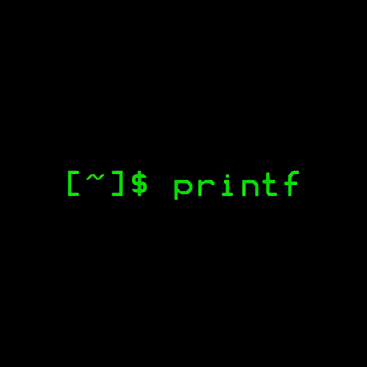

<div align="center">
<br>



</div>


<p align="center">


</p>


<h1 align="center"> C - printf </h1>


<h3 align="center">
<a href="https://github.com/RazikaBengana/holbertonschool-printf#eye-about">About</a> •
<a href="https://github.com/RazikaBengana/holbertonschool-printf#hammer_and_wrench-tasks">Tasks</a> •
<a href="https://github.com/RazikaBengana/holbertonschool-printf#computer-requirements">Requirements</a> •
<a href="https://github.com/RazikaBengana/holbertonschool-printf#bulb-more-info">More Info</a> •
<a href="https://github.com/RazikaBengana/holbertonschool-printf#package-installation">Installation</a> •
<a href="https://github.com/RazikaBengana/holbertonschool-printf#keyboard-basic-usage">Basic Usage</a> •
<a href="https://github.com/RazikaBengana/holbertonschool-printf#mag_right-resources">Resources</a> •
<a href="https://github.com/RazikaBengana/holbertonschool-printf#bust_in_silhouette-authors">Authors</a> •
<a href="https://github.com/RazikaBengana/holbertonschool-printf#octocat-license">License</a>
</h3>

---

<!-- ------------------------------------------------------------------------------------------------- -->

<br>
<br>

## :eye: About

<br>

<div align="center">

**`C - printf`** project is a collaborative effort to recreate the basic functionality of the standard C library's `printf` function.
<br>
It implements a custom `_printf` function that produces output according to a format string, supporting conversion specifiers for `characters`, `strings`, and `integers`. <br>
The project includes a **test suite** to compare the custom implementation with the original `printf`.
<br>
<br>
This project has been created by **[Holberton School](https://www.holbertonschool.com/about-holberton)** to enable every student to understand how **formatted output functions** in C language work.

</div>

<br>
<br>

### Background Context

<br>

Write your own `printf` function.

<br>
<br>

<!-- ------------------------------------------------------------------------------------------------- -->

## :hammer_and_wrench: Tasks

<br>

**`0. I'm not going anywhere. You can print that wherever you want to. I'm here and I'm a Spur for life`**

**`1. Education is when you read the fine print. Experience is what you get if you don't`**

**`2. Just because it's in print doesn't mean it's the gospel`**

**`3. With a face like mine, I do better in print`**

**`4. What one has not experienced, one will never understand in print`**

**`5. Nothing in fine print is ever good news`**

**`6. How is the world ruled and led to war? Diplomats lie to journalists and believe these lies`** <br>
**`   when they see them in print`**

**`7. My weakness is wearing too much leopard print`**

**`8. The big print gives and the small print takes away`**

**`9. Sarcasm is lost in print`**

**`10. Print some money and give it to us for the rain forests`**

**`11. The negative is the equivalent of the composer's score, and the print the performance`**

**`12. It's depressing when you're still around and your albums are out of print`**

**`13. Every time that I wanted to give up, if I saw an interesting textile, print what ever,`** <br>
**`    suddenly I would see a collection`**

**`14. Print is the sharpest and the strongest weapon of our party`**

**`15. The flood of print has turned reading into a process of gulping rather than savoring`**

**`16. * (Check if the above options work well together)`**

<br>
<br>

<!-- ------------------------------------------------------------------------------------------------- -->

## :computer: Requirements

<br>

```diff

General

+ Allowed editors: vi, vim, emacs

+ All your files will be compiled on Ubuntu 20.04 LTS using gcc, using the options -Wall -Werror -Wextra -pedantic -std=gnu89

+ All your files should end with a new line

+ A README.md file, at the root of the folder of the project is mandatory

+ Your code should use the Betty style. It will be checked using betty-style.pl and betty-doc.pl

- You are not allowed to use global variables

+ No more than 5 functions per file

+ In the following examples, the main.c files are shown as examples. You can use them to test your functions, but you don’t have to push them to your repo (if you do we won’t take them into account). We will use our own main.c files at compilation; do not push your own main.c file. Our main.c files might be different from the one shown in the examples

+ The prototypes of all your functions should be included in your header file called main.h

+ Don’t forget to push your header file

+ All your header files should be include guarded

- Note that we will not provide the _putchar function for this project

```

<br>

**_Why all your files should end with a new line? See [HERE](https://unix.stackexchange.com/questions/18743/whats-the-point-in-adding-a-new-line-to-the-end-of-a-file/18789)_**

<br>
<br>

### GitHub

<br>

There should be one project repository per group. <br>
If you clone/fork/whatever a project repository with the same name before the second deadline, you risk a 0% score.

<br>
<br>

<!-- ------------------------------------------------------------------------------------------------- -->

## :bulb: More Info

<br>

### Authorized functions and macros:

<br>

- `write` (`man 2 write`)
- `malloc` (`man 3 malloc`)
- `free` (`man 3 free`)
- `va_start` (`man 3 va_start`)
- `va_end` (`man 3 va_end`)
- `va_copy` (`man 3 va_copy`)
- `va_arg` (`man 3 va_arg`)

<br>
<br>

### Compilation:

<br>

- Your code will be compiled this way:

<br>

```yaml
$ gcc -Wall -Werror -Wextra -pedantic -std=gnu89 -Wno-format *.c
```

<br>
<br>

- As a consequence, be careful not to push any C file containing a `main` function in the root directory of your project <br>
  (you could have a `test` folder containing all your tests files including `main` functions).

- Our main files will include your main header file (`main.h`): `#include main.h`.

- You might want to look at the gcc flag `-Wno-format` when testing with your `_printf` and the standard `printf`.

<br>
<br>

- Example of test file that you could use:

<br>

```c
alex@ubuntu:~/c/printf$ cat main.c 

#include <limits.h>
#include <stdio.h>
#include "main.h"

/**
 * main - Entry point
 *
 * Return: Always 0
 */
int main(void)
{
    int len;
    int len2;
    unsigned int ui;
    void *addr;

    len = _printf("Let's try to printf a simple sentence.\n");
    len2 = printf("Let's try to printf a simple sentence.\n");
    ui = (unsigned int)INT_MAX + 1024;
    addr = (void *)0x7ffe637541f0;
    _printf("Length:[%d, %i]\n", len, len);
    printf("Length:[%d, %i]\n", len2, len2);
    _printf("Negative:[%d]\n", -762534);
    printf("Negative:[%d]\n", -762534);
    _printf("Unsigned:[%u]\n", ui);
    printf("Unsigned:[%u]\n", ui);
    _printf("Unsigned octal:[%o]\n", ui);
    printf("Unsigned octal:[%o]\n", ui);
    _printf("Unsigned hexadecimal:[%x, %X]\n", ui, ui);
    printf("Unsigned hexadecimal:[%x, %X]\n", ui, ui);
    _printf("Character:[%c]\n", 'H');
    printf("Character:[%c]\n", 'H');
    _printf("String:[%s]\n", "I am a string !");
    printf("String:[%s]\n", "I am a string !");
    _printf("Address:[%p]\n", addr);
    printf("Address:[%p]\n", addr);
    len = _printf("Percent:[%%]\n");
    len2 = printf("Percent:[%%]\n");
    _printf("Len:[%d]\n", len);
    printf("Len:[%d]\n", len2);
    _printf("Unknown:[%r]\n");
    printf("Unknown:[%r]\n");
    return (0);
}


alex@ubuntu:~/c/printf$ gcc -Wall -Wextra -Werror -pedantic -std=gnu89 -Wno-format *.c
alex@ubuntu:~/c/printf$ ./printf

Let's try to printf a simple sentence.
Let's try to printf a simple sentence.
Length:[39, 39]
Length:[39, 39]
Negative:[-762534]
Negative:[-762534]
Unsigned:[2147484671]
Unsigned:[2147484671]
Unsigned octal:[20000001777]
Unsigned octal:[20000001777]
Unsigned hexadecimal:[800003ff, 800003FF]
Unsigned hexadecimal:[800003ff, 800003FF]
Character:[H]
Character:[H]
String:[I am a string !]
String:[I am a string !]
Address:[0x7ffe637541f0]
Address:[0x7ffe637541f0]
Percent:[%]
Percent:[%]
Len:[12]
Len:[12]
Unknown:[%r]
Unknown:[%r]
alex@ubuntu:~/c/printf$
```

<br>
<br>

- We strongly encourage you to work all together on a set of tests.

- If the task does not specify what to do with an edge case, do the same as `printf`.

<br>
<br>

<!-- ------------------------------------------------------------------------------------------------- -->

## :package: Installation

<br>

### How to compile and run:

<br>

- Clone this repo:

<br>

```yaml
git clone https://github.com/MoustaphaElPsyCongroo/holbertonschool-printf.git _printf
```

<br>
<br>

- Change your directory to `_printf`:

<br>

```yaml
cd _printf
```

<br>
<br>

:pushpin: **Note**:
<br>
<br>
We provide a sample test file to try all `_printf` conversion specifiers and the majority of regular `printf` ones. <br>
Running it will print double lines of text. <br>
<br>
If two consecutive lines match, it means our `_printf` works :smile: <br>

<br>
<br>

- Compile it (install [GCC](https://www.guru99.com/c-gcc-install.html) if you didn't already):

<br>

```yaml
gcc -Wall -Werror -Wextra -pedantic -std=gnu89 -Wno-format *.c ./tests/main.c -o tryprint
```

<br>
<br>

- Run it:

<br>

```yaml
./tryprint
```

<br>
<br>

- First lines of output:

<br>

```yaml
Let's try to printf a simple sentence.
Let's try to printf a simple sentence.
Length:[39, 39]
MAX MIN:[-2147483648, 2147483647]
MAX MIN:[-2147483648, 2147483647]
Length:[34, 34]
Length:[34, 34]
Length:[39, 39]
Length:[39, 39]
Negative:[-762534]
Negative:[-762534]
```

<br>
<br>

- Consecutive lines can differ if we don't support the corresponding conversion specifier yet:

<br>

```yaml
Unsigned:[%u]
Unsigned:[4294967295]
```

<br>
<br>

- To run your own tests, just edit the `main.c` file in `tests` folder.

<br>
<br>

## :keyboard: Basic Usage

<br>

### Prototype:

<br>

- `int _printf(const char *format, ...)`

- `_printf` produces output according to the **format** string that specifies how subsequent arguments are converted for output.

<br>
<br>

### Format:

<br>

- A string to print to stdout.

- All characters except `%` are copied unchanged to stdout.

- Using the `%` character introduces a conversion specification. <br>
  It will fetch zero or more subsequent arguments "**...**". <br>

- Each conversion specification starts with a `%` followed by a conversion specifier.

<br>
<br>

- Example:

<br>

```c
char *here = "world";

_printf("Hello %s!\n", here);
```

<br>
<br>

- Output:

<br>

```yaml
$ Hello world!
```

<br>
<br>

### Conversion specifiers:

<br>

- Here is a list of all supported conversion specifiers:

<br>

|Specifier| Meaning |
|--|--|
| c | A single character **char** |
| s | A string **char \*** |
| d or i | An **int** converted to decimal notation

<br>
<br>

<!-- ------------------------------------------------------------------------------------------------- -->

## :mag_right: Resources

<br>

**_Do you need some help?_**

<br>

**Concepts:**

* [Approaching a Project](https://drive.google.com/file/d/14jooetojX4kCO9s0rLGTuLt7zOvhR78l/view?usp=sharing)

* [Group Projects](https://drive.google.com/file/d/14InHhj2FNUjyeMWkT6Kyf9S85riP71ts/view?usp=sharing)

* [Pair Programming - How To](https://drive.google.com/file/d/148LADp5Yd_FbN5tetX7cNnlrgqrsr0U6/view?usp=sharing)

* [Flowcharts](https://drive.google.com/file/d/11RwZsNudeCkK7f2JJcud1aamTGQMhQs6/view?usp=sharing)

<br>

**Read or watch:**

* [Secrets of printf](https://drive.google.com/file/d/1464eyq2z9_6l8Q10R07pki4VU4soM_BP/view?usp=sharing)

<br>

**`man` or `help`:**

* `printf (3)`

<br>
<br>

<!-- ------------------------------------------------------------------------------------------------- -->

## :bust_in_silhouette: Authors

<br>

 ---> `Github` : [MoustaphaElPsyCongroo](https://github.com/MoustaphaElPsyCongroo)


<br>
<br>

<!-- ------------------------------------------------------------------------------------------------- -->

## :octocat: License

<br>

```C - printf``` _project has no license specified._

<br>
<br>

---

<p align="center"><br>2022</p>